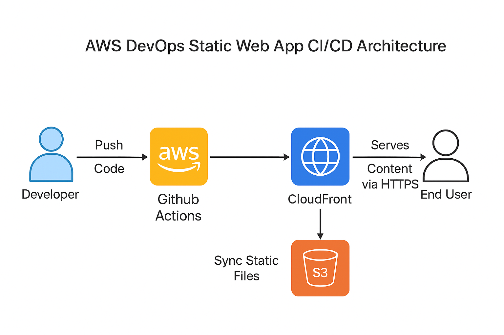

# AWS DevOps Static Web App Demo

## Overview

This project demonstrates a modern DevOps workflow for deploying a static web application using AWS and industry best practices. The demo features a login form and is hosted on AWS S3 and distributed globally via CloudFront. Infrastructure is managed with Terraform, and deployments are automated using GitHub Actions.

---

## Architecture Diagram



**Architecture Flow:**
- Developer pushes code to GitHub.
- GitHub Actions CI/CD pipeline builds and deploys the app to S3.
- CloudFront serves the static site globally.
- End users access the app via the CloudFront URL.

---

## Tech Stack Justification

- **HTML/CSS/JavaScript:** Lightweight, fast, and portable static web app.
- **AWS S3:** Reliable, scalable, and cost-effective static site hosting.
- **AWS CloudFront:** Global CDN for fast, secure content delivery.
- **Terraform:** Infrastructure as Code for reproducibility and automation.
- **GitHub Actions:** Automated CI/CD pipeline for seamless deployment.
- **GitHub Secrets:** Secure management of credentials and resource IDs.

---

## Setup Steps

### 1. Provision Infrastructure

```sh
cd iac
terraform init
terraform apply
```
- Note the outputs: `s3_bucket_name`, `cloudfront_distribution_id`, and `website_url`.

### 2. Configure GitHub Secrets

Add the following secrets in your GitHub repository under **Settings → Secrets → Actions**:

| Secret Name            | Value Source                                 |
|------------------------|----------------------------------------------|
| AWS_ACCESS_KEY_ID      | AWS IAM user Access Key ID                   |
| AWS_SECRET_ACCESS_KEY  | AWS IAM user Secret Access Key               |
| S3_BUCKET_NAME         | Terraform output: s3_bucket_name             |
| CF_DIST_ID             | Terraform output: cloudfront_distribution_id |

### 3. Configure CI/CD Workflow

Ensure your workflow file is at `.github/workflows/deploy.yml` and includes these steps:
- Checkout repository
- Configure AWS credentials
- Sync app files to S3
- Invalidate CloudFront cache

### 4. Push Code

```sh
git add .
git commit -m "Initial working CI/CD pipeline for static web app"
git push origin main
```

### 5. Verify Deployment

- Go to the **Actions** tab in GitHub and confirm the workflow runs successfully.
- Visit the CloudFront URL (`website_url` output) to access your app.

---

## Demo Credentials

- **Email:** `hire-me@anshumat.org`
- **Password:** `HireMe@2025!`

---

## Monitoring & Logging

- Enable S3 and CloudFront access logs in Terraform for basic monitoring.
- All deployments are logged in GitHub Actions for traceability.

---

## Security Best Practices

- No hardcoded AWS credentials or secrets in code.
- All sensitive values are stored in GitHub Secrets.
- Public access to S3 bucket is controlled via bucket policy and access block settings.
- IAM user used for deployment has only necessary permissions.

---

## Reasoning

This solution provides a secure, automated, and scalable way to deploy a static web app using AWS and DevOps best practices. Terraform and GitHub Actions ensure reproducibility, traceability, and easy management of infrastructure and deployments.

---
